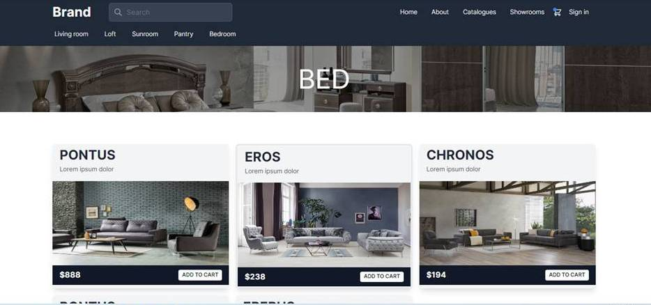

# Furniture Store

### **Topic of the project:** `Furniture Store` is a online shop where you can see all info for the company: about, shoowrooms, contact, category of products, shopping cart, and etc.




### **Ruby version:** 3.1.1 ([check here](https://github.com/Nuri1977/furniture-store/blob/master/.ruby-version))
### **Rails version:** 7.0.2 ([check here](https://github.com/Nuri1977/furniture-store/blob/master/Gemfile))

### **System dependencies:** for this project, we need Ruby and Rails
- Ruby Installation: [Click here](https://www.ruby-lang.org/en/documentation/installation/)
- Rails Installation: [Click here](https://guides.rubyonrails.org/v5.0/getting_started.html)

### **Prerequisites:**
- Git
- Node
- Yarn
- Postgresql
- Terminal

### **Technologies used:**
- Ruby
- Rails
- TailwindCSS
-
### **How to launch `Furniture Store`?**
- Clone the [repository](https://github.com/Nuri1977/furniture-store)
- Make sure you have the suitable version for the project (as stated above)
    - Note: If you do not have the suitable versions installed, refer to the links above to find the steps for installation of Ruby and Rails
- Go to the correct directory
- Run the following commands:

```
bundle
yarn install
rails db:create && rails db:migrate && rails db:seed
rails server
```
- Open your browser and go to http://localhost:3000/


👤 **NURI LACKA**

- GitHub: [@Nuri1977](https://github.com/Nuri1977)
- LinkedIn: [@Nuri](https://www.linkedin.com/in/nuri-lacka-7141b01ba/)
- Twitter: [@LackaNuri](https://twitter.com/LackaNuri)

## 🤝 Contributing

Contributions, issues, and feature requests are welcome!

Feel free to check the [issues page](https://github.com/clintonjosephs/book-a-doctor-backend/issues).

## Show your support

Give a ⭐️ if you like this project!

## Acknowledgments

- Inspiration: [@Kennedy-tech](https://github.com/OrceMaceski) Struga
- Special thanks for suporting me:
  - Orce [@OrceMaceski](https://github.com/OrceMaceski)
  - Violeta [@violeta-p](https://github.com/violeta-p)
## 📝 License

This project is [MIT](./LICENSE.md) licensed.